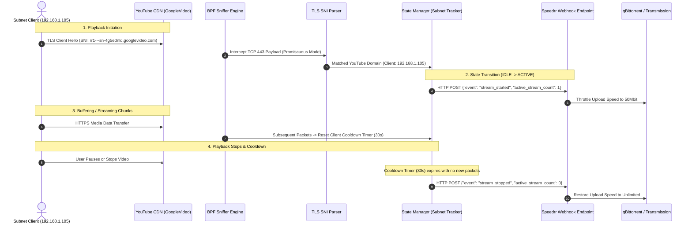
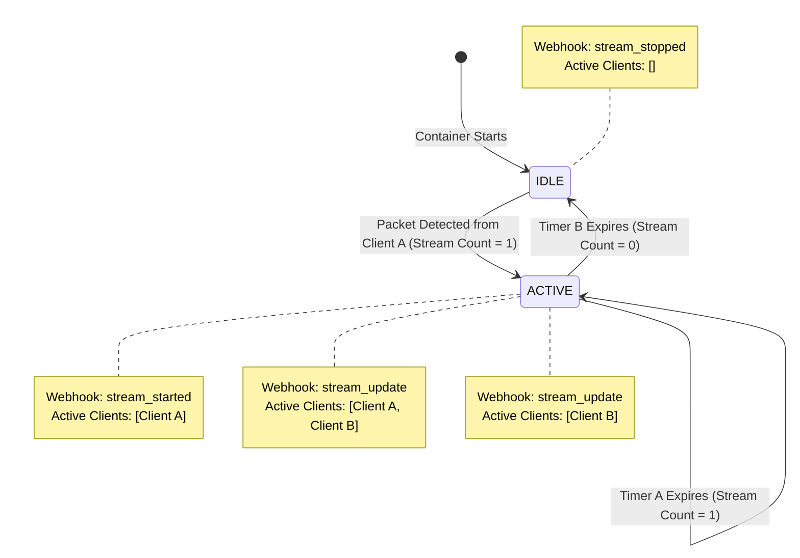

# YouTube Network Traffic Monitor Sidecar: Architecture & Design

This document outlines the architecture, data flow, packet parsing mechanics, and integration topology of the **Speedrr YouTube Network Traffic & Subnet Monitor Sidecar** (`speedrr-youtube-monitor`).

---

## 1. System Architecture

```mermaid
flowchart LR
    subgraph LAN["Zone: Home LAN / Subnet (192.168.1.0/24)"]
        TV["Client Devices<br/><i>(Smart TV, Apple TV, PC)</i>"]
        GW["Local Gateway / DNS<br/><i>(Port 53 UDP)</i>"]
    end

    subgraph SIDECAR["Sidecar Container: speedrr-youtube-monitor (Host Network)"]
        direction TB
        PCAP["BPF Packet Sniffer<br/><code>gopacket/pcap (Promiscuous)</code>"]
        PARSER["TLS SNI & DNS Parser<br/><code>googlevideo.com / youtube.com</code>"]
        STATE["Multi-Client State Manager<br/><code>sync.Mutex + Cooldown Timers</code>"]
        DISPATCH["Webhook Dispatcher<br/><code>HTTP POST JSON Client</code>"]
        
        PCAP -->|Raw L4 Packets| PARSER
        PARSER -->|Matched Stream Event| STATE
        STATE -->|Trigger Transition| DISPATCH
    end

    subgraph SPEEDRR["Zone: Speedrr Bandwidth Controller"]
        HOOK["Webhook Endpoint<br/><code>/api/v1/webhook/stream</code>"]
        EVAL["Dynamic Speed Evaluator<br/><i>(Stream-based mapping)</i>"]
        CLIENTS["Torrent Clients<br/><i>(qBittorrent / Transmission)</i>"]
        
        HOOK --> EVAL
        EVAL -->|Set Speed Limit| CLIENTS
    end

    TV -->|DNS Query & TLS Client Hello| GW
    TV -.->|Promiscuous Sniffing| PCAP
    DISPATCH ==>|Async JSON Webhook| HOOK

    classDef focal fill:#fff3ed,stroke:#eb6c36,stroke-width:2px,color:#eb6c36;
    classDef default fill:#ffffff,stroke:#2d3142,stroke-width:1px,color:#2d3142;
    classDef external fill:#f0f4f8,stroke:#4f5d75,stroke-width:1px,color:#2d3142;

    class PARSER focal;
    class TV,GW,CLIENTS external;
```



---

## 2. End-to-End Event Lifecycle



---

## 3. Core Components

### 3.1 Kernel-Level BPF Filtering
Filtering is offloaded directly to the Linux kernel using Berkeley Packet Filter (BPF) expressions. Packets outside monitored subnets or non-relevant ports are discarded at the kernel boundary before entering userspace:

$$\text{BPF Filter} = (\text{tcp or udp}) \land (\text{port } 53 \lor \text{port } 443) \land (\text{net } 192.168.1.0/24 \lor \text{host } 192.168.1.50)$$

### 3.2 Zero-Allocation TLS SNI Extraction
The TLS Parser reads the `TLS Client Hello` packet directly from raw bytes without regular expression allocations:
- **Record Layer**: Validates ContentType `0x16` (Handshake) and Version `0x0301`/`0x0303`.
- **Handshake Layer**: Validates Handshake Type `0x01` (Client Hello).
- **Extension Traversal**: Skips Client Random (32B), Session ID, Cipher Suites, and Compression Methods to parse Extension Type `0x0000` (Server Name Indication).

```
[0] 0x16 (Handshake)
 └── [5] 0x01 (Client Hello)
      └── Skip: Random (32B) + SessionID + Ciphers + Compression
           └── Extensions Block:
                └── Type 0x0000 (SNI) -> [5..5+L] "rr1---sn-4g5ednld.googlevideo.com"
```

### 3.3 Multi-Client Subnet State Machine



---

## 4. Webhook Payload Specifications

### 4.1 Stream Started Event
```json
{
  "event": "stream_started",
  "state": "ACTIVE",
  "service": "youtube",
  "target_ip": "192.168.1.105",
  "active_clients": ["192.168.1.105"],
  "active_stream_count": 1,
  "matched": "rr1---sn-4g5ednld.googlevideo.com",
  "protocol": "TLS",
  "timestamp": "2026-08-17T01:05:00Z"
}
```

### 4.2 Stream Update Event (Multiple Active Clients)
```json
{
  "event": "stream_update",
  "state": "ACTIVE",
  "service": "youtube",
  "target_ip": "192.168.1.120",
  "active_clients": ["192.168.1.105", "192.168.1.120"],
  "active_stream_count": 2,
  "matched": "rr2---sn-4g5ednld.googlevideo.com",
  "protocol": "TLS",
  "timestamp": "2026-08-17T01:05:15Z"
}
```

### 4.3 Stream Stopped Event
```json
{
  "event": "stream_stopped",
  "state": "IDLE",
  "service": "youtube",
  "target_ip": "192.168.1.120",
  "active_clients": [],
  "active_stream_count": 0,
  "matched": "cooldown_timeout",
  "protocol": "SYSTEM",
  "timestamp": "2026-08-17T01:05:45Z"
}
```

---

## 5. Security & Container Isolation

| Constraint | Configuration | Purpose |
|---|---|---|
| **Network Mode** | `network_mode: host` | Required to capture promiscuous L2/L3 frames on host network interfaces |
| **Linux Capabilities** | `CAP_NET_RAW`, `CAP_NET_ADMIN` | Minimal privileges needed for PCAP socket creation and interface promiscuity |
| **Non-Root Execution** | `USER speedrr` (UID/GID 1000) | Rootless process execution inside container via `setcap` file capabilities |
| **Minimal Base** | `alpine:3.21` | Hardened minimal image surface (~12 MB) |
